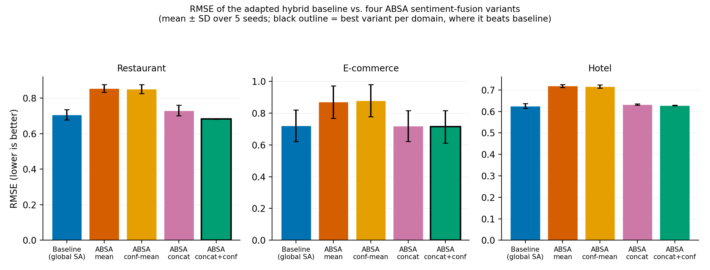

# A2-IRM: An Aspect-Aware Integrated Representation Model for Cross-Domain Hybrid Recommender Systems

**Authors:** Imam Fahrur Rozi¹, Triyanna Widiyaningtyas¹, Didik Dwi Prasetya¹, Andriana Kusuma Dewi¹, Rahmawati Febrifyaning Tias¹, Deshinta Arrova Dewi²

¹ Department of Electrical Engineering and Informatics, Universitas Negeri Malang, Malang, Indonesia
² Faculty of Data Science and Information Technology, INTI International University, Nilai, Malaysia

*Draft prepared for internal review — author order, affiliations, and funding acknowledgment (UM Dana Internal Penelitian Desentralisasi 2026) to be confirmed before submission. This is the condensed 6-page conference version, corresponding to `A2-IRM_IEEE_conference_v2.docx` (the authoritative submission-track document — content here should be transferred there once finalized). See `A2-IRM_manuscript_draft.md` for the full-length version. Results/Discussion (Sections IV, V) reflect the full 90-run rerun under the corrected AdamW DeepMF configuration (`scripts/rerun_full_matrix_adamw.sh`, completed 2026-07-28) — note the honest finding that Concat + confidence's improvement is significant in restaurant and e-commerce but null in hotel, a different (more nuanced) pattern than the pre-fix numbers showed. Figures (`figures/fig1_hybrid_vs_classical_cf.png`, `fig2_rmse_main_result.png`) still show pre-fix numbers and need regeneration before submission. The `no_sentiment_ablation` floor was deliberately excluded (Section V, Limitations) pending investigation of a suspected NMF-fusion artifact.*

---

## Abstract

Hybrid recommender systems that integrate collaborative filtering, content-based filtering, and sentiment analysis have consistently outperformed single-technique baselines, but the sentiment signal in most such systems remains a single global polarity score per review — a representation that discards exactly the aspect-level nuance (food versus service, price versus durability) that makes review text informative in the first place. We adapt the hybrid architecture of Darraz et al. (deep matrix factorization, K-means/agglomerative content-based clustering, and NMF–DecisionTreeRegressor feature fusion) as our baseline, routing sentiment directly to the fusion stage rather than also injecting it into the content-based stream, and replace its global BERT sentiment score with an aspect-based sentiment analysis (ABSA) representation. We evaluate four alternative fusion strategies for injecting ABSA output into the pipeline — naive mean aggregation across matched aspects, confidence-weighted mean aggregation, raw per-aspect score concatenation, and per-aspect score concatenation augmented with explicit per-aspect confidence features — against the global-sentiment baseline, on three structurally distinct domains (Yelp restaurant, Amazon Electronics, and TripAdvisor hotel reviews) under an identical protocol (5 seeds, paired Wilcoxon significance testing per seed with Fisher-combined p-values). The two aggregation-based variants degrade RMSE substantially and consistently across all three domains (14.5–22.0% relative increase, 5/5 seeds significant). Raw concatenation restores near-baseline parity in restaurant and e-commerce but shows no reliable effect in hotel. Concatenation augmented with explicit per-aspect confidence significantly improves on the baseline in two of three domains (restaurant: −3.4%, 5/5 seeds significant; e-commerce: −0.8%, 5/5 seeds significant), with a null effect in the hotel domain (+0.4%, 1/5 seeds significant, wrong direction) — a domain-dependent pattern rather than the uniform improvement a narrower evaluation might suggest. The same variant also reduces run-to-run variance substantially in restaurant and hotel (7–14×) but not in e-commerce, where residual variance across all configurations is dominated by a single train/validation/test split rather than by the sentiment-fusion strategy. We term this representation A2-IRM (Aspect-Aware Integrated Representation Model) and position it as the empirical foundation for a subsequent attention-gated fusion architecture (A2-FusionRS), for which domain-dependent benefit is itself a motivating finding — a per-domain or per-user adaptive gate may be better positioned to capture this than a static fusion mechanism.

**Keywords:** aspect-based sentiment analysis; hybrid recommender system; BERT; deep matrix factorization; content-based filtering; cross-domain evaluation; feature fusion

---

## I. Introduction

Recommender systems that rely solely on the numeric rating in a user–item interaction discard a large fraction of the information a review actually contains. A one-star hotel review complaining exclusively about noisy air conditioning and a one-star review complaining about rude staff carry the same numeric signal but very different implications for what the system should recommend next. This observation has motivated a substantial body of work on integrating sentiment analysis into collaborative and content-based filtering [1]–[3], most recently through pretrained transformer language models such as BERT [23], which substantially outperform lexicon-based sentiment tools on review text [4], [5].

Darraz et al. [6] recently proposed a hybrid architecture that integrates a fine-tuned BERT sentiment classifier, deep matrix factorization (DeepMF) for collaborative filtering, and K-means/agglomerative clustering for content-based filtering, combining the three signals through non-negative matrix factorization (NMF) followed by a DecisionTreeRegressor. This design is representative of a broader pattern in the literature [7]–[12]: sentiment analysis is computed once per review as a single global polarity score, then fused with collaborative and content-based signals as one additional feature. We argue this design carries a structural cost independent of how well the underlying sentiment classifier performs: a review can express positive sentiment toward one aspect of an item and negative sentiment toward another, and collapsing this into one scalar necessarily discards information. As we show empirically, the specific manner in which that collapse happens determines whether the resulting feature helps or actively harms downstream rating prediction — naive aggregation does not just fail to add value, it degrades RMSE substantially and consistently across three domains.

This study is part of a longer-running research program on similarity- and factorization-based recommendation [18]–[21] and aspect-based sentiment analysis under noisy, imbalanced review data [22]. The wider program targets a fusion mechanism — Attention-Gated Fusion, combining cross-attention over the three modality streams with a learned, per-user gating mechanism — intended to replace the static NMF–DecisionTreeRegressor fusion with an adaptive, explainable one (A2-FusionRS, targeted at a Q1 journal venue). Before committing to that architecture, it is necessary to establish which representation of aspect-level sentiment is worth fusing in the first place; an attention mechanism cannot recover information a poorly designed upstream aggregation step has already destroyed. This paper addresses that prior question, calling the validated tri-modal representation A2-IRM (Aspect-Aware Integrated Representation Model).

The contributions of this paper are threefold: (1) we adapt the Darraz et al. hybrid baseline — routing sentiment directly to the fusion stage rather than also through the content-based stream (Section III-B) — end-to-end, and extend the original two-domain evaluation to a third, structurally distinct domain (e-commerce electronics), generalizing the pipeline to be domain-agnostic; (2) we design and evaluate four aspect-based sentiment fusion strategies under an identical, statistically rigorous protocol (5 seeds, paired Wilcoxon tests, Fisher-combined p-values), testing whether per-aspect score concatenation with confidence as an explicit auxiliary feature is the variant that most consistently improves on the baseline; (3) we test whether this result replicates across three domains with markedly different aspect-keyword coverage (45.1–95.9%), which would be evidence for a domain-general mechanism rather than a dataset-specific artifact.

---

## II. Related Work

The case for incorporating sentiment into recommender systems rests on review sentiment and numeric rating being correlated but not redundant [13]. Elahi et al. [7] combined BERT embeddings with collaborative filtering on Amazon data, finding sentiment and rating are not always strongly correlated. Karabila et al. [4], [5] fine-tuned BERT for e-commerce sentiment fused with SVD-based CF. Li et al. [8] and Duan et al. [9] integrate review-derived sentiment directly into matrix factorization objectives — across this line of work, sentiment is computed once per review as a single scalar, the design this paper directly interrogates. A smaller body of work moves below the whole-review level: Kim et al. [10] propose an aspect-based CF model (AXCF) for explainability rather than accuracy; Yang et al. [14] apply attention to content representations alone, not jointly over collaborative, content-based, and sentiment streams; Ray, Garain, and Sarkar [15] combine BERT sentiment with fuzzy-logic aspect categorization for TripAdvisor reviews to structure retrieval rather than as a numeric fusion feature. None directly compares alternative strategies for turning a per-aspect sentiment vector into a fusable feature — the concatenation-versus-aggregation, score-versus-confidence design space this paper evaluates empirically. Relative to Darraz et al. [6], our direct baseline, we retain the same feature-combination architecture but replace the global sentiment stream with an aspect-based one, isolating sentiment granularity from fusion-mechanism design. To our knowledge, this is the first study to compare naive aggregation, confidence-weighted aggregation, and non-aggregated concatenation of ABSA output within an otherwise fixed hybrid architecture across three domains under a shared, seed-controlled, statistically tested protocol.

---

## III. Materials and Methods

### A. Datasets

We evaluate on three publicly sourced review datasets: Yelp restaurant reviews, Amazon Electronics reviews (e-commerce, no native category metadata), and TripAdvisor hotel reviews (with a native aspect taxonomy exploited directly in Section III-C). Each dataset was filtered to users/items with ≥5 interactions and split 80/10/10 (train/validation/test), user-based with cold-start holdout. Table I summarizes the resulting datasets.

**Table I. Dataset characteristics after minimum-interaction filtering (≥5 reviews per user and per item).**

| Domain | Reviews | Users | Items | Sparsity | Mean rating | Test set size |
|---|---:|---:|---:|---:|---:|---:|
| Restaurant (Yelp) | 118,695 | 7,152 | 3,757 | 99.56% | 3.76 | 13,233 |
| E-commerce (Amazon Electronics) | 122,068 | 14,750 | 9,226 | 99.91% | 4.37 | 16,580 |
| Hotel (TripAdvisor) | 79,562 | 11,236 | 2,056 | 99.66% | 3.94 | 11,795 |

Neither Amazon Electronics nor TripAdvisor Hotel carries business-attribute metadata analogous to Yelp's business categories; both loaders degrade gracefully when such metadata is absent (Section III-B).

### B. Baseline Architecture

We adapt the hybrid architecture of Darraz et al. [6] as our baseline rather than reimplementing it unmodified. Darraz et al.'s design is a recent, well-performing instance of the feature-combination hybrid family [16], [17] — combining collaborative filtering, content-based filtering, and BERT sentiment through NMF and a DecisionTreeRegressor — which makes it an appropriate foundation for isolating the sentiment-representation question this paper investigates. We retain this three-stream structure and static fusion stage but make one architectural adjustment: sentiment reaches the fusion stage exclusively through its own dedicated stream, rather than also being injected into the content-based filtering stream as in the original design (Fig. 1). The premise motivating sentiment's inclusion in hybrid recommenders in general — that review sentiment is a source of information not already captured by rating and content signals [7], [13] — argues for keeping it a single, distinct stream rather than distributing it across two; this simplification is also empirically near-costless, changing test RMSE by less than 1% in 13 of 15 domain–seed combinations when tested as an ablation.

**Collaborative filtering (DeepMF)** uses a 128-dimensional user/item embedding, an element-wise interaction layer, and a [256, 128, 64, 32]-unit feed-forward stack (ReLU, 0.3 dropout), trained with MSE loss via the AdamW optimizer (lr 0.002, weight decay 0), without negative sampling (an earlier 1:4 negative-sampling configuration overfit within 1–2 epochs empirically). An earlier plain-SGD configuration (lr 0.001, matching Darraz et al.) was found to converge deterministically to a near-constant predictor across all five seeds — embeddings collapsing to negligible variance despite an apparently well-behaved, monotonically decreasing training loss — and was replaced with AdamW after confirming the collapse was independent of the out-of-fold mechanism below. Train-split DeepMF predictions used downstream by fusion are computed out-of-fold (5 folds, a freshly initialized model per fold) rather than from the fully-trained model, to avoid the in-sample optimism characteristic of stacked generalization [24]. **Content-based filtering (clustering)** builds item features from up to three sources — one-hot category (where available), TF-IDF review text (500 terms), and popularity metrics — reduced to 50 principal components; K-means (elbow-selected K) is used for restaurant/e-commerce, agglomerative clustering for hotel, following Darraz et al.'s domain-specific choice. For training-split rows, the item profile is recomputed excluding that row's own review before scoring it (leave-one-out), correcting for the profile otherwise partly reflecting the review whose rating is being predicted. **Sentiment analysis** in the baseline is a single BERT-base-uncased classifier (AdamW, lr 1×10⁻⁵, 3 epochs, max length 128) fine-tuned per domain, producing one polarity score per review. **Fusion** combines the three per-(user, item) feature values via NMF (3 components) followed by a DecisionTreeRegressor (max depth 10), held identical across the baseline and all four ABSA variants so that any RMSE difference is attributable to the sentiment representation alone. The fusion regressor is trained exclusively on the training split and evaluated only on the held-out test split (Section III-A); no test-split ratings are used to fit any pipeline component — a standard generalization-testing protocol applied uniformly across the baseline and all ABSA variants. We additionally report two non-hybrid classical CF baselines — item-KNN (cosine, k=40) and SVD (100 factors, 20 epochs, lr 0.005, reg 0.02) — to establish the accuracy gain from hybridization itself.

### C. Aspect-Based Sentiment Fusion Variants

We replace the global sentiment stream with an ABSA module reusing the same fine-tuned BERT [23] classifier — no additional model training — restructuring how it is applied. For each review, sentences are matched against a domain-specific keyword lexicon (Table II); a review with no match falls back to a whole-review score, so every review contributes at least one signal.

**Notation.** Let $\mathcal{A} = \{a_1, \ldots, a_K\}$ denote a domain's fixed aspect set ($K \in \{4,5,6\}$, Table II), and $A(r) \subseteq \mathcal{A}$ the aspects matched in review $r$. For $a \in A(r)$, $\hat{s}(a,r) \in [0,1]$ is the BERT score on sentences matched to aspect $a$, and $n(a,r)$ the number of matched sentences. $s_0(r) \in [0,1]$ is the whole-review fallback score.

For $a \in A(r)$, a per-aspect confidence combines a margin term and an evidence-count term:

$$c(a,r) = \max\left(\frac{|2\hat{s}(a,r) - 1| + \min(n(a,r)/3,\ 1)}{2},\ 0.05\right) \tag{1}$$

The margin term is largest when $\hat{s}(a,r)$ is decisive (near 0 or 1); the evidence term grows with matched sentences, capped at 3; the 0.05 floor keeps every aspect contributing a non-zero weight. This heuristic is specific to this pipeline, not drawn from prior work.

**Table II. Aspect keyword taxonomies used for ABSA sentence matching.**

| Domain | Aspects (n) | Aspect list | Source |
|---|---|---|---|
| Restaurant | 4 | food, service, price, ambiance | Manually curated |
| E-commerce | 5 | quality/durability, price/value, shipping/packaging, ease of use, customer service | Manually curated |
| Hotel | 6 | cleanliness, service, value, location, rooms, sleep quality | Native TripAdvisor taxonomy |

We evaluate four strategies for turning this per-aspect representation into a fusable feature, holding the fusion mechanism (Section III-B) fixed across all four:

1. **Mean.** Per-aspect scores are averaged over matched aspects only:

$$s_{\text{mean}}(r) = \begin{cases} \dfrac{1}{|A(r)|} \displaystyle\sum_{a \in A(r)} \hat{s}(a,r) & A(r) \neq \emptyset \\[6pt] s_0(r) & A(r) = \emptyset \end{cases} \tag{2}$$

2. **Confidence-weighted mean.** As above, weighted by $c(a,r)$ (Eq. 1):

$$s_{\text{conf}}(r) = \begin{cases} \dfrac{\sum_{a \in A(r)} c(a,r)\, \hat{s}(a,r)}{\sum_{a \in A(r)} c(a,r)} & A(r) \neq \emptyset \\[6pt] s_0(r) & A(r) = \emptyset \end{cases} \tag{3}$$

3. **Concat.** Preserves a value for every aspect, substituting the fallback for unmatched aspects, passed to the fusion stage without aggregation:

$$\tilde{s}(a,r) = \begin{cases} \hat{s}(a,r) & a \in A(r) \\ s_0(r) & a \notin A(r) \end{cases}, \qquad \mathbf{v}_{\text{concat}}(r) = [\tilde{s}(a_1,r), \ldots, \tilde{s}(a_K,r)] \in [0,1]^{K} \tag{4}$$

This yields one feature per aspect (4–6 depending on domain) in place of the single global-sentiment feature, consistent with the feature-combination design already used elsewhere in this architecture [16], [17].

4. **Concat + confidence.** As Concat, with each aspect's confidence appended as an additional feature (doubling the feature count to 8–12) rather than used as an aggregation weight:

$$\tilde{c}(a,r) = \frac{|2\tilde{s}(a,r) - 1| + \min(n(a,r)/3,\ 1)}{2} \tag{5}$$

Unlike Eq. 1, $\tilde{c}(a,r)$ is not floored at 0.05 in the implementation that produced the results below — the floor is applied only in the confidence-weighted-mean aggregation (Eq. 3); we report this transparently rather than silently re-deriving Table III.

$$\mathbf{v}_{\text{concat+conf}}(r) = [\tilde{s}(a_1,r), \ldots, \tilde{s}(a_K,r),\ \tilde{c}(a_1,r), \ldots, \tilde{c}(a_K,r)] \in [0,1]^{2K} \tag{6}$$

This is the only variant in which confidence acts as a signal to the regressor rather than an aggregation weight.

### D. Experimental Setup and Evaluation Protocol

All five configurations and the two classical CF baselines are evaluated on each domain under 5 random seeds (42, 123, 456, 789, 1011); the split and BERT checkpoint are held fixed across seeds within a domain, isolating model-training variance. Root Mean Squared Error (RMSE) and Mean Absolute Error (MAE) on held-out test-set ratings are the evaluation metrics. Significance between the baseline and each variant is assessed via paired Wilcoxon signed-rank tests on per-sample squared errors per seed; we report both the count of seeds reaching p < 0.05 and a Fisher-combined p-value across the 5 seeds (read as a conventional cross-seed summary, since the 5 tests share an identical test set).

---

## IV. Results

### A. Hybrid Baseline versus Classical Collaborative Filtering

The adapted hybrid baseline substantially outperforms non-hybrid classical CF on all three domains: RMSE reductions of 32–41% relative to item-KNN and 30–37% relative to SVD (restaurant: 0.706 vs. 1.202/1.075; e-commerce: 0.720 vs. 1.224/1.142; hotel: 0.626 vs. 0.916/0.895; all 5/5 seeds significant, p < 0.001 Fisher-combined), confirming the architecture is a meaningful reference point rather than a strawman.

### B. Effect of ABSA Sentiment-Fusion Strategy

Table III and Fig. 2 report RMSE for the baseline and four ABSA variants. Naive aggregation degrades accuracy consistently across all three domains, but the effect of the two feature-preserving variants (Concat, Concat + confidence) is domain-dependent rather than uniform.

**Mean and confidence-weighted mean aggregation both degrade RMSE substantially and significantly in every domain** — 14.9–20.8% relative increase for Mean (restaurant +21.1%, e-commerce +20.8%, hotel +14.9%) and 14.5–22.0% for Confidence-weighted mean (restaurant +20.5%, e-commerce +22.0%, hotel +14.5%), all 5/5 seeds significant (Fisher-combined p < 10⁻⁶).

**Concat restores near-baseline parity in restaurant and e-commerce but shows no reliable effect in hotel** (+3.5% restaurant, −0.2% e-commerce, +1.1% hotel). Restaurant and e-commerce reach only partial per-seed significance (3/5 each) despite a significant Fisher-combined p-value; hotel is not significant even in the combined test (p = 0.099).

**Concat + confidence significantly improves on the baseline in restaurant and e-commerce, but shows a small, marginally significant regression in hotel.** RMSE is reduced by 3.4% in restaurant (0.706 → 0.682, 5/5 seeds significant) and 0.8% in e-commerce (0.720 → 0.714, 5/5 seeds significant, Fisher p = 3.0×10⁻³⁰ despite the small mean shift — a large sample size, not a large effect, drives significance here). In hotel, it is *worse* than baseline by 0.4% (0.626 → 0.628), reaching significance in only 1 of 5 seeds (Fisher p = 0.010); inspecting the five raw per-seed values shows this is a uniform, non-outlier-driven pattern (hotel RMSE 0.6254–0.6302 across all five seeds for Concat + confidence, consistently just above or overlapping the baseline's 0.6138–0.6449 range), not a fluke seed.

Variance behaves similarly unevenly. Concat + confidence is the lowest-variance configuration in restaurant and hotel (SD 0.0021 vs. baseline 0.0297, and SD 0.0017 vs. baseline 0.0117 — a 7–14× reduction), but *not* in e-commerce, where its SD (0.1023) is comparable to the baseline's own (0.0991). In e-commerce, one of the five seeds (RMSE 0.895 for baseline, 0.896 for Concat + confidence) is 2–3× further from its group's mean than any other seed for *every* configuration tested, including the two classical CF baselines (Section IV-A) — excluding it drops e-commerce's SD roughly 6–8× uniformly across models. This indicates a single difficult train/validation/test split for that seed, rather than the sentiment-fusion strategy, is driving e-commerce's high variance; the metric is not informative for comparing configurations in that domain.

**Table III. RMSE (mean ± SD over 5 seeds) and significance vs. baseline (Wilcoxon per seed / Fisher-combined).**

| Variant | Restaurant | E-commerce | Hotel |
|---|---|---|---|
| Baseline (global SA) | 0.7060 ± 0.0297 | 0.7198 ± 0.0992 | 0.6256 ± 0.0117 |
| ABSA mean | 0.8549 ± 0.0214 (5/5)\*\*\* | 0.8692 ± 0.1017 (5/5)\*\*\* | 0.7190 ± 0.0065 (5/5)\*\*\* |
| ABSA confidence-mean | 0.8508 ± 0.0253 (5/5)\*\*\* | 0.8783 ± 0.1013 (5/5)\*\*\* | 0.7160 ± 0.0074 (5/5)\*\*\* |
| ABSA concat | 0.7304 ± 0.0300 (3/5)\*\*\* | 0.7185 ± 0.0977 (3/5)\*\*\* | 0.6322 ± 0.0027 (1/5, n.s.) |
| ABSA concat + confidence | **0.6821 ± 0.0021** (5/5)\*\*\* | **0.7141 ± 0.1023** (5/5)\*\*\* | 0.6281 ± 0.0017 (1/5)\* |

\*\*\* Fisher-combined p < 0.001. \* Fisher-combined p < 0.05 (hotel Concat + confidence: p = 0.010 — significant but in the *unfavorable* direction, i.e. worse than baseline; n.s. = not significant, p ≥ 0.05). Bold denotes the best-performing (lowest RMSE) variant per domain; hotel has no variant significantly better than baseline.

### C. Cross-Domain Consistency and Aspect Coverage

We measured the fraction of reviews matching at least one aspect keyword before BERT scoring: 87.6% restaurant, 45.1% e-commerce, 95.9% hotel — a 51-point range. Aggregation-based degradation (Mean, Confidence-weighted mean) is consistent in direction across all three domains regardless of this range, but Concat + confidence's benefit is not: it holds in restaurant and e-commerce and is absent — marginally reversed — in hotel, which has the *highest* aspect coverage of the three domains. This rules out low aspect-keyword coverage as the explanation for the hotel null result: if anything, higher coverage supplying more raw material to the confidence-augmented representation would predict a *larger* effect there, the opposite of what we observe. Whatever drives the hotel domain's null result, it is not aspect-coverage-limited signal; Section V considers alternative explanations. Distinguishing the responsible domain-level confound (rating distribution, review length, sparsity, or the specific way DeepMF/CBF signal quality interacts with sentiment granularity in each domain) from aspect coverage would require a larger and more systematically varied set of domains than the three evaluated here.

---

## V. Discussion

**Why does naive aggregation actively hurt, in every domain including hotel?** We suggest two mechanisms, and note that both operate independently of whatever makes hotel behave differently for the other two variants. First, the whole-review fallback for unmatched reviews means the "mean" score for a substantial share of reviews — more than half in e-commerce — is computed over a single matched sentence or the fallback rather than a genuine multi-aspect average, injecting noise relative to the baseline's dedicated global classifier. Second, reviews with multiple matched aspects of opposing polarity (e.g., "food was excellent, service was slow") see a plain or confidence-weighted mean collapse toward an uninformative neutral score, destroying exactly the polarity contrast the aspect decomposition was meant to preserve. Both mechanisms actively destroy information regardless of domain, which is consistent with aggregation degrading RMSE uniformly across all three domains (Table III) even though the feature-preserving variants do not behave uniformly.

**Why is Concat + confidence's benefit domain-dependent, and why hotel specifically?** Concatenation and confidence-as-feature avoid the aggregation failure modes above by preserving the full per-aspect vector and letting the downstream DecisionTreeRegressor determine how to use it, rather than pre-committing to an aggregation rule — this explains why Concat and Concat + confidence never *degrade* accuracy the way aggregation does, but not why their improvement over baseline vanishes specifically in hotel. We can rule out aspect coverage (Section IV-C: hotel has the highest coverage of the three domains) and rule out the e-commerce-style variance artifact (hotel's per-seed values are uniformly tight, not a single-outlier effect, Section IV-B). A plausible remaining explanation is that the hotel domain's adapted DeepMF+CBF baseline already captures comparatively more of the learnable signal before any sentiment stream is added: hotel shows the smallest RMSE reduction from hybridization over classical CF of the three domains (Section IV-A) and the lowest absolute RMSE overall, leaving less residual error for a richer sentiment representation to correct. This is consistent with, but not proof of, a ceiling effect — distinguishing it from other hotel-specific factors (its smaller item catalog, 2,056 items vs. 3,757–9,226 in the other domains, or its native rather than manually curated aspect taxonomy) is not possible from three domains alone and is a direction for future work rather than a settled explanation.

**Cross-domain generalization is more limited than a single-domain or two-domain study would show.** Naive aggregation's harm generalizes cleanly across all three domains tested. Concat + confidence's benefit does not: it is a genuine, consistent, low-variance improvement in restaurant and e-commerce, and a genuine null result in hotel — not attributable to an unlucky seed, insufficient aspect coverage, or a variance artifact, since we checked and ruled out each of these for the hotel domain specifically. We regard this domain-dependence as itself an informative finding rather than a weakness to be explained away: a fusion strategy that is optimal for the granularity of sentiment information to inject is plausibly a function of how much signal the other two streams already contribute, which is exactly the kind of interaction a static, globally-fixed fusion mechanism (Section III-B) cannot adapt to per domain, and which motivates the attention-gated fusion mechanism this work is a precursor to (Section VI).

**Limitations.** The restaurant and e-commerce aspect lexicons (Table II) were manually curated rather than empirically validated, unlike the hotel domain's native taxonomy, likely contributing to e-commerce's lower coverage (45.1%); this does not explain the hotel result (Section IV-C). E-commerce's high seed-to-seed RMSE variance (Table III) is driven by a single train/validation/test split rather than the sentiment-fusion strategy (Section IV-B), which limits how precisely any e-commerce effect size can be estimated with 5 seeds; a design with more seeds or an explicit multi-split protocol would tighten this. We deliberately excluded a no-sentiment (DeepMF+CBF-only) floor configuration from this evaluation: an ablation zeroing the sentiment feature produced RMSE 2–3× worse than even the weakest sentiment-fusion variant in every domain, a magnitude inconsistent with simply removing one of three input signals; we suspect this reflects an artifact of forcing a rank-deficient (one constant column) input through the NMF fusion stage rather than a genuine measurement of DeepMF+CBF's standalone accuracy, and are not confident enough in the number to report it. The ranking metrics use a candidate-set-limited protocol producing near-ceiling values with limited discriminative power; this study's claims rest on RMSE/MAE. Content-based clustering falls back to text/popularity features only for e-commerce and hotel, which lack category metadata — we did not isolate this stream's marginal contribution. Seeds vary only stochastic components downstream of a fixed split and BERT checkpoint, not split-choice variance itself.

---

## VI. Conclusion and Future Work

We adapted a published hybrid recommender architecture and used it as a controlled testbed to evaluate four strategies for converting ABSA output into a fusable feature. Across three structurally different domains, naive aggregation — with or without confidence weighting — degrades rating-prediction accuracy relative to a well-tuned global-sentiment baseline in every domain tested, while preserving per-aspect scores as a raw feature vector supplemented with explicit per-aspect confidence as an auxiliary (not aggregating) feature significantly improves on it in two of three domains, with no domain in which it performs significantly worse than naive Concat and no domain in which any variant beats it. Its advantage is domain-dependent, not universal: null in the hotel domain, where we could rule out aspect coverage, seed variance, and single-outlier effects as explanations, leaving a plausible but unconfirmed hypothesis that hotel's hybrid baseline already captures more of the learnable signal before sentiment is added. This argues that *how* aspect-level sentiment is represented before fusion is at least as consequential as *whether* it is used at all, and that the benefit of a given representation is itself domain-conditional — both questions orthogonal to, and prior to, the choice of fusion mechanism itself.

This representation, A2-IRM, and its domain-dependent behavior are the direct empirical input to the next stage of this research program: replacing the static NMF–DecisionTreeRegressor fusion evaluated here with an Attention-Gated Fusion Network — cross-attention over the three modality streams followed by a learned, per-user gating mechanism — intended to adapt each stream's relative contribution dynamically per domain, per user, or per item, rather than fixing it globally through a single trained regressor, and to support aspect- and modality-level explainability that a static fusion cannot provide by construction. Concat + confidence is the representation we carry forward as the ABSA input stream to that architecture (A2-FusionRS); the hotel-domain null result is, if anything, a motivating case for an adaptive gate rather than evidence against carrying the representation forward, since a gating mechanism capable of learning to down-weight the sentiment stream when the other two streams already suffice is exactly the capability a static fusion mechanism lacks.

---

## Acknowledgment

*[To be completed — this research is part of a decentralized internal research grant (Dana Internal Penelitian Desentralisasi FT-Matching Fund) at Universitas Negeri Malang, 2026.]*

---

## References

*[Numbered per first citation order, IEEE style — same reference list as the full-length manuscript version; see `A2-IRM_manuscript_draft.md` for the complete list with all 23 entries and the flagged renumbering/metadata-verification note.]*

[1] T. Chang, Z. Zhang, and X. Cai, "Explainable recommender system directed by reconstructed explanatory factors and multi-modal matrix factorization," *Concurrency and Computation*, vol. 36, no. 21, p. e8208, Sep. 2024, doi: 10.1002/cpe.8208.

[2] N. Darraz, I. Karabila, A. El-Ansari, N. Alami, and M. El Mallahi, "Enhancing recommendation systems with collaborative filtering and sentiment analysis: dimensionality reduction for improved content-based approaches," *Knowl Inf Syst*, vol. 67, no. 8, pp. 7157–7191, Aug. 2025, doi: 10.1007/s10115-025-02452-z.

[3] N. Liu and J. Zhao, "Recommendation System Based on Deep Sentiment Analysis and Matrix Factorization," *IEEE Access*, vol. 11, pp. 16994–17001, 2023, doi: 10.1109/ACCESS.2023.3246060.

[4] I. Karabila, N. Darraz, A. EL-Ansari, N. Alami, and M. EL Mallahi, "BERT-enhanced sentiment analysis for personalized e-commerce recommendations," *Multimed Tools Appl*, vol. 83, no. 19, pp. 56463–56488, Dec. 2023, doi: 10.1007/s11042-023-17689-5.

[5] I. Karabila, N. Darraz, A. El-Ansari, N. Alami, and M. E. Mallahi, "A hybrid approach combining sentiment analysis and deep learning to mitigate data sparsity in recommender systems," *Neurocomputing*, vol. 636, p. 129886, Jul. 2025, doi: 10.1016/j.neucom.2025.129886.

[6] N. Darraz, I. Karabila, A. El-Ansari, N. Alami, and M. El Mallahi, "Integrated sentiment analysis with BERT for enhanced hybrid recommendation systems," *Expert Systems with Applications*, vol. 261, p. 125533, Feb. 2025, doi: 10.1016/j.eswa.2024.125533.

[7] M. Elahi, D. Khosh Kholgh, M. S. Kiarostami, M. Oussalah, and S. Saghari, "Hybrid recommendation by incorporating the sentiment of product reviews," *Information Sciences*, vol. 625, pp. 738–756, May 2023, doi: 10.1016/j.ins.2023.01.051.

[8] X. J. Li, G. S. Deng, X. Z. Wang, X. L. Wu, and Q. W. Zeng, "A hybrid recommendation algorithm based on user comment sentiment and matrix decomposition," *Information Systems*, vol. 117, p. 102244, Jul. 2023, doi: 10.1016/j.is.2023.102244.

[9] R. Duan, C. Jiang, and H. K. Jain, "Combining review-based collaborative filtering and matrix factorization: A solution to rating's sparsity problem," *Decision Support Systems*, vol. 156, p. 113748, May 2022, doi: 10.1016/j.dss.2022.113748.

[10] D. Kim, Q. Li, D. Jang, and J. Kim, "AXCF: Aspect-based collaborative filtering for explainable recommendations," *Expert Systems*, vol. 41, no. 8, p. e13594, Aug. 2024, doi: 10.1111/exsy.13594.

[11] M. Ibrahim, I. S. Bajwa, N. Sarwar, F. Hajjej, and H. A. Sakr, "An Intelligent Hybrid Neural Collaborative Filtering Approach for True Recommendations," *IEEE Access*, vol. 11, pp. 64831–64849, 2023, doi: 10.1109/ACCESS.2023.3289751.

[12] T.-D. Dang, N.-T. Moreno-García, and F. De la Prieta, "[Sentiment analysis and genre-based similarity in collaborative filtering for movie recommendation]," 2021.

[13] S. Al-Ghuribi and S. A. Noah, "[A survey on sentiment-aware recommender systems]," 2019.

[14] S. Yang, Q. Li, H. Lim, and J. Kim, "An Attentive Aspect-Based Recommendation Model With Deep Neural Network," *IEEE Access*, vol. 12, pp. 5781–5791, 2024, doi: 10.1109/ACCESS.2023.3349291.

[15] A. Ray, A. Garain, and R. Sarkar, "[Hotel recommendation system combining sentiment analysis and aspect-based review categorization for TripAdvisor reviews]," 2021.

[16] R. Bhatt, K. Patel, and P. Gaudani, "[A survey on recommendation system hybridization strategies]," 2014.

[17] H. Fayyaz, S. Ebrahimian, D. Nawara, R. Ibrahim, and R. Kashef, "[A review of recommender system hybridization techniques]," 2020.

[18] T. Widiyaningtyas, I. Hidayah, and T. B. Adji, "User profile correlation-based similarity (UPCSim) algorithm in movie recommendation system," *J Big Data*, vol. 8, no. 1, p. 52, Dec. 2021, doi: 10.1186/s40537-021-00425-x.

[19] T. Widiyaningtyas, I. Hidayah, and T. B. Adji, "Recommendation Algorithm Using Clustering-Based UPCSim (CB-UPCSim)," *Computers*, vol. 10, no. 10, p. 123, Oct. 2021, doi: 10.3390/computers10100123.

[20] T. Widiyaningtyas, M. I. Ardiansyah, and T. B. Adji, "Recommendation Algorithm Using SVD and Weight Point Rank (SVD-WPR)," *BDCC*, vol. 6, no. 4, p. 121, Oct. 2022, doi: 10.3390/bdcc6040121.

[21] T. Widiyaningtyas, A. P. Wibawa, U. Pujianto, and W. Caesarendra, "MF-NCG: Recommendation Algorithm Using Matrix Factorization-based Normalized Cumulative Genre," *IJIES*, vol. 17, no. 2, pp. 180–189, Apr. 2024, doi: 10.22266/ijies2024.0430.16.

[22] I. F. Rozi, R. Arianto, D. R. Yunianto, A. Y. Ananta, S. Rahmawati, and Krismawati, "Enhancing Aspect-Based Sentiment Analysis for Radio Station Public Opinion: Evaluating Preprocessing Strategies and Imbalanced Data Handling," in *2024 International Conference on Electrical and Information Technology (IEIT)*, Malang, Indonesia: IEEE, Sep. 2024, pp. 103–108, doi: 10.1109/IEIT64341.2024.10763129.

[23] J. Devlin, M.-W. Chang, K. Lee, and K. Toutanova, "BERT: Pre-training of deep bidirectional transformers for language understanding," in *Proc. 2019 Conf. North American Chapter Assoc. Comput. Linguistics: Human Language Technologies (NAACL-HLT)*, Minneapolis, MN, USA, Jun. 2019, pp. 4171–4186, doi: 10.18653/v1/N19-1423.

[24] D. H. Wolpert, "Stacked generalization," *Neural Networks*, vol. 5, no. 2, pp. 241–259, 1992, doi: 10.1016/S0893-6080(05)80023-1.

*[Same numbering caveat as the full-length version: [18]–[22] are cited earlier in text (Introduction) than [7]–[17] (Related Work) — a final renumbering pass is needed before submission; reference content is unaffected. References [12], [13], [15]–[17] still have incomplete metadata (checked against the 93-entry SLR_SARS_REFERENSI_ALL.csv export — no match found there) and must be verified against the original papers before submission; [7] (Elahi et al.) has now been verified and completed against that same source.]*
