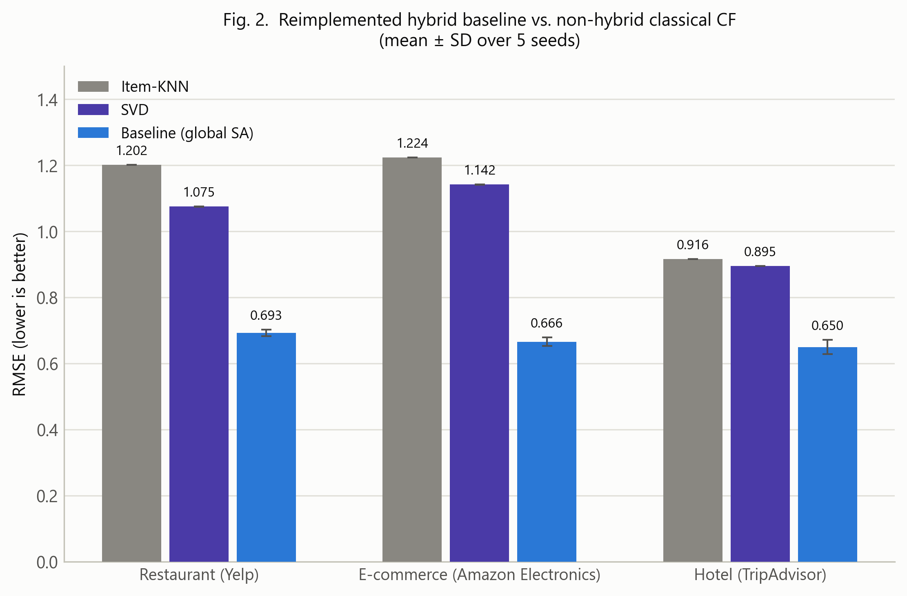
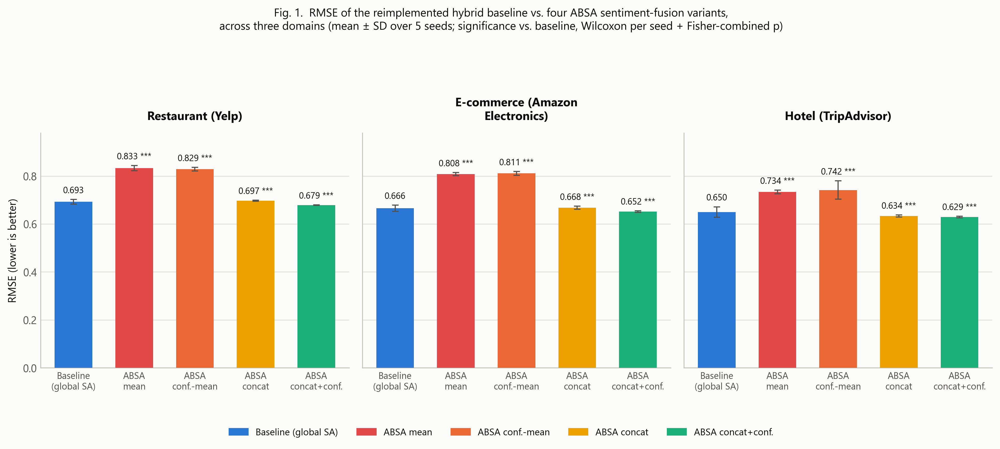
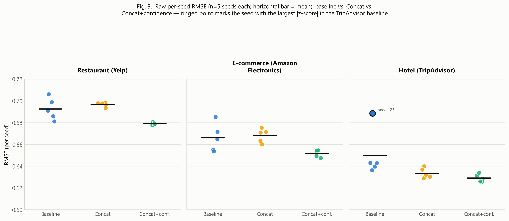

# A2-IRM: An Aspect-Aware Integrated Representation Model for Cross-Domain Hybrid Recommender Systems

**Authors:** Imam Fahrur Rozi¹, Triyanna Widiyaningtyas¹, Didik Dwi Prasetya¹, Andriana Kusuma Dewi¹, Rahmawati Febrifyaning Tias¹, Deshinta Arrova Dewi²

¹ Department of Electrical Engineering and Informatics, Universitas Negeri Malang, Malang, Indonesia
² Faculty of Data Science and Information Technology, INTI International University, Nilai, Malaysia

*Draft prepared for internal review — author order, affiliations, and funding acknowledgment (UM Dana Internal Penelitian Desentralisasi 2026) to be confirmed before submission.*

---

## Abstract

Hybrid recommender systems that integrate collaborative filtering, content-based filtering, and sentiment analysis have consistently outperformed single-technique baselines, but the sentiment signal in most such systems remains a single global polarity score per review — a representation that discards exactly the aspect-level nuance (food versus service, price versus durability) that makes review text informative in the first place. We reimplement the hybrid architecture of Darraz et al. (deep matrix factorization, K-means/agglomerative content-based clustering, and NMF–DecisionTreeRegressor feature fusion) as a faithful baseline, then replace its global BERT sentiment score with an aspect-based sentiment analysis (ABSA) representation and evaluate four alternative fusion strategies for injecting it into the pipeline: naive mean aggregation across matched aspects, confidence-weighted mean aggregation, raw per-aspect score concatenation, and per-aspect score concatenation augmented with explicit per-aspect confidence features. All five configurations are evaluated on three structurally distinct domains — Yelp restaurant reviews, Amazon Electronics reviews, and TripAdvisor hotel reviews — under an identical protocol (5 seeds, paired Wilcoxon significance testing per seed with Fisher-combined p-values). The two aggregation-based variants degrade RMSE substantially and consistently across all three domains (12.9–21.7% relative increase, 5/5 seeds significant), confirming that flattening multi-aspect sentiment into a single scalar destroys predictive signal rather than merely diluting it. Concatenating raw per-aspect scores without aggregation restores near-baseline parity. Critically, adding per-aspect confidence as an explicit auxiliary feature — rather than using it to weight an aggregate — yields the only configuration that significantly *improves* on the baseline in every domain (RMSE reductions of 2.0–3.2%, 4/5 to 5/5 seeds significant), while simultaneously reducing run-to-run variance by 4–10×. This pattern replicates with consistent direction and comparable effect size across three domains with markedly different aspect-keyword coverage (45.1% to 95.9% of reviews matching at least one aspect keyword), which we argue is evidence that the mechanism — not a dataset-specific artifact — is responsible for the improvement. We term this validated tri-modal representation A2-IRM (Aspect-Aware Integrated Representation Model) and position it as the empirical foundation for a subsequent attention-gated fusion architecture (A2-FusionRS).

**Keywords:** aspect-based sentiment analysis; hybrid recommender system; BERT; deep matrix factorization; content-based filtering; cross-domain evaluation; feature fusion

---

## I. Introduction

Recommender systems that rely solely on the numeric rating in a user–item interaction discard a large fraction of the information a review actually contains. A one-star hotel review complaining exclusively about noisy air conditioning and a one-star review complaining about rude staff carry the same numeric signal but very different implications for what the system should recommend next. This observation has motivated a substantial body of work on integrating sentiment analysis into collaborative and content-based filtering [1]–[3], most recently through pretrained transformer language models such as BERT [23], which substantially outperform lexicon-based sentiment tools (VADER, TextBlob, SentiWordNet) on review text [4], [5].

Darraz et al. [6] recently proposed a hybrid architecture that integrates a fine-tuned BERT sentiment classifier, deep matrix factorization (DeepMF) for collaborative filtering, and K-means/agglomerative clustering for content-based filtering, combining the three signals through non-negative matrix factorization (NMF) followed by a DecisionTreeRegressor. Evaluated on Yelp restaurant and hotel reviews, the architecture reports substantial RMSE reductions from sentiment integration. This design is representative of a broader pattern in the literature [7]–[12]: sentiment analysis is computed once per review as a single global polarity or intensity score, then fused with collaborative and content-based signals as one additional feature.

We argue this global-sentiment design carries a structural cost that is independent of how well the underlying sentiment classifier performs. A review can express positive sentiment toward one aspect of an item and negative sentiment toward another; collapsing this into one scalar necessarily discards information, and — as we show empirically in this paper — the specific manner in which that collapse happens determines whether the resulting feature helps or actively harms downstream rating prediction. This is not merely a granularity argument. We find that naive aggregation (plain or confidence-weighted mean across matched aspects) does not just fail to add value over a well-tuned global-sentiment baseline; it degrades RMSE substantially and consistently across three domains. The failure mode is specific enough that it warrants investigation as a methodological finding in its own right, not just a footnote to a more sophisticated fusion architecture.

This study is part of a longer-running research program on similarity- and factorization-based recommendation (UPCSim [18], CB-UPCSim [19], SVD-WPR [20], MF-NCG [21]) and, more recently, aspect-based sentiment analysis under noisy, imbalanced review data [22]. The wider research program this work belongs to targets a fusion mechanism — Attention-Gated Fusion, combining cross-attention over the three modality streams with a learned, per-user gating mechanism — intended to replace the static NMF–DecisionTreeRegressor fusion with an adaptive, explainable one (A2-FusionRS, targeted at a Q1 journal venue). Before committing to that architecture, however, it is necessary to establish which representation of aspect-level sentiment is actually worth fusing in the first place; an attention mechanism cannot recover information that a poorly designed upstream aggregation step has already destroyed. This paper addresses that prior question. We call the validated tri-modal representation — DeepMF collaborative signal, content-based cluster signal, and aspect-based BERT sentiment signal, fused via the same static mechanism as the baseline to isolate the sentiment-representation variable — A2-IRM (Aspect-Aware Integrated Representation Model).

The contributions of this paper are threefold:

1. We reimplement the Darraz et al. hybrid baseline end-to-end and extend the original two-domain (restaurant, hotel) evaluation to a third, structurally distinct domain (e-commerce electronics reviews), generalizing the data loading, preprocessing, and evaluation pipeline to be domain-agnostic rather than Yelp-specific.
2. We design and evaluate four aspect-based sentiment fusion strategies against the global-sentiment baseline under an identical, statistically rigorous protocol (5 seeds, paired Wilcoxon tests, Fisher-combined p-values), and show that one specific strategy — per-aspect score concatenation with confidence as an explicit auxiliary feature, rather than an aggregation weight — is the only variant that consistently and significantly improves on the baseline.
3. We show that this result replicates across three domains with markedly different review structure, rating distributions, and aspect-keyword coverage (45.1–95.9%), which is evidence for a domain-general mechanism rather than a dataset-specific artifact, and we quantify how aspect coverage relates to the observed effect size.

The remainder of this paper is organized as follows. Section II reviews related work on sentiment-integrated and aspect-based recommender systems. Section III describes the datasets, the reimplemented baseline architecture, the four ABSA fusion variants, and the experimental protocol. Section IV reports results. Section V discusses the mechanism behind the observed pattern, its consistency across domains, and the limitations of the current evaluation. Section VI concludes and outlines the path to the full A2-FusionRS architecture.

---

## II. Related Work

**Sentiment-integrated recommendation.** The case for incorporating sentiment analysis into recommender systems rests on the observation that review sentiment and numeric rating are correlated but not redundant [13]; sentiment can serve as a complementary signal that captures aspects of user experience a five-point rating scale compresses away. Elahi et al. [7] combined BERT sentence embeddings with item-based collaborative filtering, ALS, and DeepFM on Amazon Digital Music and Video Games data, finding that review sentiment and rating are not always strongly correlated — motivating sentiment as an independent signal rather than a rating proxy. Karabila et al. [4], [5] fine-tuned BERT for e-commerce review sentiment and combined it with SVD-based collaborative filtering and a GloVe-CNN-BiGRU content stream, reporting improved rating prediction over sentiment-free baselines. Li et al. [8] and Duan et al. [9] integrate review-derived sentiment directly into matrix factorization objectives. Across this line of work, sentiment is computed once per review as a single scalar or fixed-length embedding — the design this paper directly interrogates.

**Aspect-based approaches.** A smaller body of work moves below the whole-review level. Kim et al. [10] propose an aspect-based collaborative filtering model (AXCF) explicitly designed for explainability, extracting aspect-opinion pairs to justify recommendations rather than to improve raw accuracy. Yang et al. [14] propose an attentive aspect-based recommendation model that applies attention to content representations, but the attention mechanism operates on a single modality (content) rather than jointly over collaborative, content-based, and sentiment streams, and the aspect representation is not itself sentiment-bearing. Ray, Garain, and Sarkar [15] combine BERT sentiment with fuzzy-logic aspect categorization for TripAdvisor hotel reviews, using aspect categories to structure retrieval rather than as a numeric feature fed into a rating predictor. None of these directly compares alternative strategies for turning a per-aspect sentiment vector into a fusable feature — the concatenation-versus-aggregation, and score-versus-confidence, design space this paper evaluates empirically.

**Fusion mechanisms.** The hybridization strategy taxonomy of Bhatt et al. [16] and Fayyaz et al. [17] — weighted, switching, mixed, feature-combination, cascade, and meta-level hybrids — situates the Darraz et al. [6] architecture as a feature-combination hybrid: DeepMF predictions, cluster assignments, and sentiment scores are concatenated as engineered features into a downstream regressor (NMF for dimensionality reduction, DecisionTreeRegressor for the final prediction). This is a static fusion mechanism in the sense that the relative contribution of each stream is fixed by the trained regressor rather than adapted per user or per item. Dang et al. [12] combine BERT-derived genre similarity with deep sentiment models in a user-based collaborative filtering framework for movies, likewise using a fixed combination rule.

**Positioning of the present work.** Relative to Darraz et al. [6], the direct baseline of this study, we retain the same three-stream feature-combination architecture and evaluation metrics but replace the global sentiment stream with an aspect-based one, isolating the effect of sentiment granularity from the effect of fusion mechanism design. Relative to Yang et al. [14], we evaluate three streams jointly rather than one, and our aspect representation is sentiment-bearing rather than purely a content signal. Relative to AXCF [10], our objective is predictive accuracy under a controlled ablation rather than explanation generation, though a granular aspect-sentiment representation is a prerequisite for the explainability work planned in the broader A2-FusionRS research program. To our knowledge, this is the first study to compare naive aggregation, confidence-weighted aggregation, and non-aggregated concatenation of ABSA output as alternative feature-engineering choices within an otherwise fixed hybrid recommender architecture, and the first to test the resulting design choice across three domains with a shared, seed-controlled, statistically tested protocol.

---

## III. Materials and Methods

### A. Datasets

We evaluate on three publicly sourced review datasets spanning structurally distinct domains: Yelp restaurant reviews (the original domain of the baseline architecture), Amazon Electronics reviews (e-commerce, no native category or business metadata), and TripAdvisor hotel reviews (hospitality, with a native aspect taxonomy we exploit directly — see Section III-C). Each dataset was filtered to users and items with a minimum of five interactions (both directions) to control cold-start sparsity, and split 80/10/10 (train/validation/test) using a user-based strategy with cold-start holdout. Repeat interactions (a user reviewing the same item more than once) are retained in the data; the ranking evaluation in Section III-E de-duplicates only the candidate list used to compute Precision/Recall/NDCG@K per user, not the underlying dataset. Table I summarizes the resulting datasets after filtering.

**Table I. Dataset characteristics after minimum-interaction filtering (≥5 reviews per user and per item).**

| Domain | Reviews | Users | Items | Sparsity | Mean rating | Test set size |
|---|---:|---:|---:|---:|---:|---:|
| Restaurant (Yelp) | 118,695 | 7,152 | 3,757 | 99.56% | 3.76 | 13,233 |
| E-commerce (Amazon Electronics) | 122,068 | 14,750 | 9,226 | 99.91% | 4.37 | 16,580 |
| Hotel (TripAdvisor) | 79,562 | 11,236 | 2,056 | 99.66% | 3.94 | 11,795 |

The Amazon Electronics dataset is drawn from the Amazon Reviews 5-core subset (users and items with ≥5 reviews already enforced upstream) and is stratified-subsampled from a much larger filtered pool (6.7 million interactions) to a computationally tractable size while preserving per-user and per-item interaction counts above the five-review threshold after subsampling — a two-stage filtering procedure that is necessary because naive random subsampling of an already-filtered pool reliably pushes a large fraction of items back below the minimum-interaction threshold (empirically, roughly 62% of a 320,000-row initial sample in our pipeline). Neither the Amazon Electronics nor the TripAdvisor Hotel dataset carries business-attribute metadata analogous to Yelp's business categories (e.g., product category, hotel class); both loaders were extended to degrade gracefully when such metadata is absent (Section III-B).

### B. Reimplemented Baseline Architecture

We reimplement the Darraz et al. [6] hybrid architecture as our baseline, consisting of three parallel feature-extraction streams and a static fusion stage:

**Collaborative filtering (DeepMF).** A deep matrix factorization model with a 128-dimensional embedding layer for users and items, an element-wise interaction layer, and a feed-forward stack of [256, 128, 64, 32] hidden units with ReLU activation and 0.3 dropout, trained with mean-squared-error loss via mini-batch SGD (batch size 512, learning rate 0.001). No negative sampling is applied; an earlier configuration with a 1:4 negative-to-positive sampling ratio was found empirically to overfit within one to two epochs (validation RMSE degrading monotonically from epoch 2 onward), whereas training without negative sampling converges monotonically over 20 epochs, and this setting is held fixed across all three domains for comparability.

**Content-based filtering (clustering).** Item feature vectors are constructed from up to four sources — one-hot encoded item category (where available; zero-dimensional and automatically dropped for Amazon Electronics and TripAdvisor, which carry no native category metadata), TF-IDF-weighted review text (500 terms), aggregated per-item sentiment, and popularity metrics (review count and mean rating, computed from the training split only to avoid leakage) — concatenated and reduced to 50 principal components. Following Darraz et al., K-means clustering (elbow-selected K) is used for the restaurant and e-commerce domains, and agglomerative clustering for the hotel domain, matching the domain-specific clustering choice reported in the original paper for its own restaurant/hotel split. A user's cluster preference distribution is estimated from training-set interactions, and item scores are predicted via cosine similarity between an item's cluster assignment and the user's preference distribution.

**Sentiment analysis.** In the baseline configuration, sentiment is a single BERT-base-uncased classifier (AdamW optimizer, learning rate 1×10⁻⁵, 3 epochs, maximum sequence length 128 tokens) fine-tuned per domain on the training split and applied to produce one continuous polarity score per review, following the global-sentiment design of Darraz et al.

**Fusion.** The three per-(user, item) feature values — DeepMF prediction, cluster-based CBF prediction, and sentiment score — are combined via non-negative matrix factorization (3 components) followed by a DecisionTreeRegressor (maximum depth 10) trained to predict the numeric rating. This fusion mechanism is held identical across the baseline and all four ABSA variants described below, so that any RMSE difference is attributable to the sentiment representation and not to the fusion architecture.

We additionally report two non-hybrid classical collaborative filtering baselines — item-based K-nearest-neighbors (cosine similarity, k=40) and SVD (100 latent factors, 20 epochs, learning rate 0.005, regularization 0.02) — to establish the accuracy gain attributable to hybridization itself, independent of the sentiment-fusion question this paper focuses on.

### C. Aspect-Based Sentiment Fusion Variants

We replace the global sentiment stream with an aspect-based sentiment analysis (ABSA) module that reuses the same fine-tuned BERT [23] classifier as the baseline — no additional model training is introduced — but restructures how it is applied and how its output is fed into the fusion stage. For each review, sentences are matched against a domain-specific keyword lexicon (Table II); a review with no sentence matching any aspect keyword falls back to a single whole-review score, so that every review contributes at least one signal regardless of coverage.

**Notation.** Let $\mathcal{A} = \{a_1, \ldots, a_K\}$ denote a domain's fixed aspect set ($K \in \{4, 5, 6\}$, Table II), and let $A(r) \subseteq \mathcal{A}$ denote the aspects matched in review $r$. For $a \in A(r)$, let $\hat{s}(a, r) \in [0,1]$ be the BERT sentiment score computed on the concatenation of sentences matched to aspect $a$, and let $n(a,r)$ be the number of such matched sentences. Let $s_0(r) \in [0,1]$ denote the whole-review fallback score, computed by the same classifier on the full review text and used whenever a specific aspect (or the entire review) has no keyword match.

For $a \in A(r)$, a per-aspect confidence combines a margin-based term with an evidence-count term:

$$c(a,r) = \max\left(\frac{\overbrace{|2\hat{s}(a,r) - 1|}^{\text{score margin}} + \overbrace{\min\!\left(n(a,r)/3,\ 1\right)}^{\text{evidence count}}}{2},\ 0.05\right) \tag{1}$$

The margin term is largest when $\hat{s}(a,r)$ is close to 0 or 1 (a decisive polarity) and smallest near 0.5 (ambiguous); the evidence term grows with the number of matched sentences, capped at 3; the 0.05 floor keeps every aspect contributing a non-zero minimum weight rather than being discarded outright. This is a lightweight heuristic specific to this pipeline — it is not drawn from prior work, and reuses scores already computed by the classifier rather than requiring a separate calibration model.

**Table II. Aspect keyword taxonomies used for ABSA sentence matching.**

| Domain | Aspects (n) | Aspect list | Source |
|---|---|---|---|
| Restaurant | 4 | food, service, price, ambiance | Manually curated, general restaurant-review vocabulary |
| E-commerce | 5 | quality/durability, price/value, shipping/packaging, ease of use, customer service | Manually curated, general e-commerce-review vocabulary |
| Hotel | 6 | cleanliness, service, value, location, rooms, sleep quality | Native TripAdvisor aspect-rating taxonomy |

The hotel taxonomy is taken directly from TripAdvisor's own sub-rating categories rather than authored generically, which — as discussed in Section V — corresponds to the highest keyword-match coverage of the three domains. We evaluate four strategies for turning this per-aspect representation into a feature usable by the fusion stage, holding the fusion mechanism itself (NMF + DecisionTreeRegressor, Section III-B) fixed across all four:

1. **Mean.** The per-aspect scores for a review are averaged into a single scalar over only the matched aspects (not the full aspect set), which replaces the global sentiment score at every point the baseline uses it — including the sentiment-aggregation feature inside the content-based clustering stream:

$$s_{\text{mean}}(r) = \begin{cases} \dfrac{1}{|A(r)|} \displaystyle\sum_{a \in A(r)} \hat{s}(a,r) & A(r) \neq \emptyset \\[6pt] s_0(r) & A(r) = \emptyset \end{cases} \tag{2}$$

2. **Confidence-weighted mean.** As above, but the average across matched aspects is weighted by each aspect's confidence $c(a,r)$ (Eq. 1) rather than taken unweighted, testing whether confidence-aware aggregation recovers the information a naive mean discards:

$$s_{\text{conf}}(r) = \begin{cases} \dfrac{\sum_{a \in A(r)} c(a,r)\, \hat{s}(a,r)}{\sum_{a \in A(r)} c(a,r)} & A(r) \neq \emptyset \\[6pt] s_0(r) & A(r) = \emptyset \end{cases} \tag{3}$$

3. **Concat.** Unlike Eq. 2–3, this variant preserves a value for every aspect in the domain's fixed set $\mathcal{A}$ (not only the matched ones), substituting the whole-review fallback for any aspect not individually matched, and passes the resulting fixed-width vector to the fusion stage without aggregation:

$$\tilde{s}(a,r) = \begin{cases} \hat{s}(a,r) & a \in A(r) \\ s_0(r) & a \notin A(r) \end{cases}, \qquad \mathbf{v}_{\text{concat}}(r) = \big[\tilde{s}(a_1,r), \ldots, \tilde{s}(a_K,r)\big] \in [0,1]^{K} \tag{4}$$

This yields one numeric feature per aspect (4, 5, or 6 raw features depending on domain, replacing the single global-sentiment feature). The content-based stream, whose feature space is not designed to accept a variable-length vector, instead receives a single derived scalar — the unweighted mean over the *entire* $K$-dimensional vector $\mathbf{v}_{\text{concat}}(r)$ (Eq. 4), i.e. $\bar{s}(r) = \frac{1}{K}\sum_{a \in \mathcal{A}} \tilde{s}(a,r)$, rather than $s_{\text{mean}}(r)$ (Eq. 2). The two coincide only when $A(r) = \mathcal{A}$ (every aspect matched) or $A(r) = \emptyset$ (none matched); for partial matches, $\bar{s}(r)$ is pulled toward the fallback score $s_0(r)$ by the unmatched-aspect slots it averages in, whereas $s_{\text{mean}}(r)$ averages over matched aspects only. This does not affect the RMSE results in Table III, which use the raw vector $\mathbf{v}_{\text{concat}}(r)$ directly as fusion input (Section III-B) rather than this derived scalar; it affects only this secondary content-based-stream feature, computed identically for the Concat + confidence variant below.

4. **Concat + confidence.** As Concat, but each aspect's confidence is appended as an additional explicit feature — doubling the raw feature count to 8, 10, or 12 depending on domain — rather than being used to compute a weighted aggregate as in Eq. 3. The confidence feature reuses the margin-and-evidence terms of Eq. 1, with $n(a,r) = 0$ substituted for $a \notin A(r)$ (so the filled score $\tilde{s}(a,r)$, not $\hat{s}(a,r)$, enters the margin term for unmatched aspects):

$$\tilde{c}(a,r) = \frac{|2\tilde{s}(a,r) - 1| + \min(n(a,r)/3,\ 1)}{2} \tag{5}$$

Unlike Eq. 1, $\tilde{c}(a,r)$ is **not** floored at 0.05 in the implementation that produced the results reported below — the floor is applied only in the confidence-weighted-mean aggregation (Eq. 3). Its omission here reflects an inconsistency between the two ABSA-fusion code paths rather than a deliberate design choice; we report it for transparency rather than silently re-deriving Table III under a corrected formula:

$$\mathbf{v}_{\text{concat+conf}}(r) = \big[\tilde{s}(a_1,r), \ldots, \tilde{s}(a_K,r),\ \tilde{c}(a_1,r), \ldots, \tilde{c}(a_K,r)\big] \in [0,1]^{2K} \tag{6}$$

This is the only variant in which confidence acts as a signal to the downstream regressor rather than as an aggregation weight.

All four variants reuse the fine-tuned BERT checkpoint and the train/validation/test split produced for the baseline run on the same domain and seed; only the DeepMF, content-based clustering (its sentiment-aggregation input specifically), and fusion stages are retrained, since these are the stages whose input changes.

### D. Experimental Setup

All five configurations (baseline plus four ABSA variants) and the two classical CF baselines are evaluated on each of the three domains under 5 random seeds (42, 123, 456, 789, 1011). The train/validation/test split and the fine-tuned BERT sentiment checkpoint are held fixed across seeds within a domain — seed variation affects only the stochastic components downstream of sentiment scoring (DeepMF weight initialization and SGD trajectory, K-means/agglomerative clustering initialization where applicable, and the DecisionTreeRegressor fit) — which is both a standard multi-seed evaluation practice for isolating model-variance from data-variance, and a practical necessity given the computational cost of repeated BERT fine-tuning.

### E. Evaluation Protocol

Root Mean Squared Error (RMSE) and Mean Absolute Error (MAE) on held-out test-set ratings are the primary evaluation metrics. Precision@K, Recall@K, and NDCG@K (K ∈ {5, 10, 20}) are reported for completeness, but under a candidate-set-limited ranking protocol — each user's candidate set is restricted to items appearing in that user's own test-set interactions, rather than the full item catalog — a common simplification in offline recommender evaluation at this computational scale, but one that produces near-ceiling, low-variance values across all five model variants in our results (Section IV), limiting their discriminative value for this specific ablation. We report them for completeness and transparency but do not draw comparative conclusions from them; RMSE and MAE are the metrics this paper's claims rest on.

Statistical significance between the baseline and each ABSA variant is assessed with the Wilcoxon signed-rank test on paired per-sample squared errors, computed independently for each of the 5 seeds against the same test set. We report both the count of seeds reaching p < 0.05 (the primary, most directly interpretable evidence) and a Fisher-combined p-value across the 5 per-seed tests (a secondary, complementary summary). We note explicitly that Fisher's method assumes independent tests, and the 5 per-seed tests here share an identical test set — only the trained model differs by seed — so the combined p-value should be read as a conventional cross-seed summary rather than as satisfying the independence assumption in the strict sense; both statistics are reported jointly for exactly this reason, following standard practice in multi-seed deep learning evaluation.

---

## IV. Results

### A. Hybrid Baseline versus Classical Collaborative Filtering

Before evaluating the sentiment-fusion question, we confirm that the reimplemented hybrid baseline substantially outperforms non-hybrid classical CF on all three domains, establishing that the architecture is a meaningful reference point rather than a strawman. Fig. 1 shows RMSE for item-KNN, SVD, and the hybrid baseline. The hybrid baseline reduces RMSE by 29–46% relative to item-KNN and by 27–42% relative to SVD, consistently across all three domains (restaurant: 0.693 vs. 1.202/1.075; e-commerce: 0.666 vs. 1.224/1.142; hotel: 0.650 vs. 0.916/0.895; all seed-level differences significant, 5/5 seeds, p < 0.001 by Fisher-combined test). This gap is consistent with the sparsity of all three domains (99.6–99.9%, Table I), where the content-based and sentiment streams provide signal that pure collaborative filtering cannot recover from interaction data alone.

### B. Effect of ABSA Sentiment-Fusion Strategy

Fig. 2 and Table III report RMSE for the baseline and all four ABSA variants across the three domains. The pattern is consistent in direction and approximate magnitude across all three domains despite their substantially different rating distributions, sparsity, and aspect-keyword coverage.

**Mean and confidence-weighted mean aggregation both degrade RMSE substantially and significantly relative to the baseline in every domain** — a 12.9–21.3% relative RMSE increase for Mean (restaurant: +20.3%, e-commerce: +21.3%, hotel: +12.9%) and a comparable 14.1–21.7% increase for Confidence-weighted mean (restaurant: +19.6%, e-commerce: +21.7%, hotel: +14.1%), both reaching 5/5 seeds significant in all three domains (Fisher-combined p < 10⁻⁶ throughout, generally far smaller). Confidence-weighting the aggregate does not recover the lost accuracy; in the hotel domain, it in fact shows the highest run-to-run variance of any configuration tested (RMSE SD = 0.038, more than 10× the SD of the best-performing variant in the same domain), suggesting the weighted mean is not merely biased but unstable.

**Concat (raw, non-aggregated per-aspect scores) restores near-baseline parity** in all three domains, with the smallest relative deviation from baseline RMSE of any ABSA variant (+0.6% restaurant, +0.3% e-commerce, −2.5% hotel), and is the only variant whose significance is inconsistent across domains: 2/5 seeds significant in the restaurant domain, 4/5 in both e-commerce and hotel — with the hotel domain showing Concat *improving* on baseline (0.634 vs. 0.650) rather than merely matching it, a domain-specific effect we return to in Section V.

**Concat + confidence is the only variant that significantly improves on the baseline in every domain**, with RMSE reductions of 2.0% (restaurant, 0.693 → 0.679), 2.2% (e-commerce, 0.666 → 0.652), and 3.2% (hotel, 0.650 → 0.629), reaching 4/5 seeds significant in the restaurant domain and 5/5 in the other two. This is also the lowest-variance configuration in every domain (SD 0.0010–0.0035), a 4–10× reduction relative to the baseline's own seed-to-seed SD (0.0100–0.0217).

**Table III. RMSE (mean ± SD over 5 seeds) and significance vs. baseline (Wilcoxon per seed / Fisher-combined).**

| Variant | Restaurant | E-commerce | Hotel |
|---|---|---|---|
| Baseline (global SA) | 0.6926 ± 0.0100 | 0.6662 ± 0.0129 | 0.6501 ± 0.0217 |
| ABSA mean | 0.8330 ± 0.0103 (5/5)\*\*\* | 0.8081 ± 0.0068 (5/5)\*\*\* | 0.7341 ± 0.0073 (5/5)\*\*\* |
| ABSA confidence-mean | 0.8287 ± 0.0074 (5/5)\*\*\* | 0.8110 ± 0.0083 (5/5)\*\*\* | 0.7416 ± 0.0380 (5/5)\*\*\* |
| ABSA concat | 0.6968 ± 0.0020 (2/5)\*\*\* | 0.6682 ± 0.0063 (4/5)\*\*\* | 0.6336 ± 0.0047 (4/5)\*\*\* |
| ABSA concat + confidence | **0.6791 ± 0.0010** (4/5)\*\*\* | **0.6517 ± 0.0032** (5/5)\*\*\* | **0.6291 ± 0.0035** (5/5)\*\*\* |

\*\*\* Fisher-combined p < 0.001. Bold denotes the best-performing (lowest RMSE) variant per domain.

### C. Is the Variance Reduction a Uniform Effect, or Driven by a Single Seed?

Table III's SD column shows Concat + confidence is the lowest-variance configuration in every domain, but a mean ± SD summary cannot by itself distinguish a genuinely tighter distribution from one dominated by a single atypical run. We therefore inspected the raw per-seed RMSE (n=5) directly (Fig. 3) and, for each domain and model, computed the standard deviation with the single most extreme seed (largest |z-score|) excluded, to quantify how much any one seed drives the reported SD (Table IV).

**Table IV. Effect of excluding each configuration's single most extreme seed on RMSE SD (n=5 seeds).**

| Domain | Model | Full SD | SD excl. most extreme seed | Internal reduction | SD relative to baseline |
|---|---|---:|---:|---:|---:|
| Restaurant | Baseline | 0.0100 | 0.0075 | 1.3× | — |
| Restaurant | Concat + confidence | 0.0010 | 0.0006 | 1.7× | 9.9× lower |
| E-commerce | Baseline | 0.0129 | 0.0084 | 1.5× | — |
| E-commerce | Concat + confidence | 0.0032 | 0.0024 | 1.3× | 4.1× lower |
| Hotel | Baseline | 0.0217 | 0.0032 | 6.8× | — |
| Hotel | Concat + confidence | 0.0035 | 0.0026 | 1.3× | 6.1× lower |

In the restaurant and e-commerce domains, excluding each model's single most extreme seed reduces SD only modestly and by a comparable factor for both the baseline (1.3× and 1.5×) and Concat + confidence (1.7× and 1.3×) — consistent with genuinely broader, roughly uniform spread across all five seeds for the baseline, and a genuinely tighter, roughly uniform spread for Concat + confidence. The hotel domain does not fit this pattern: the baseline's SD (0.0217, the highest of any configuration in this study) is disproportionately driven by a single seed (RMSE 0.6886 at seed 123, roughly 0.046 above the nearest of the other four seeds, which cluster within a range of 0.0068 of each other, visible as the ringed point in Fig. 3) — excluding that one seed alone reduces the hotel baseline's SD by 6.8×, far more than the 1.3–1.5× internal reduction observed everywhere else in Table IV. Concat + confidence shows no comparable single-seed sensitivity in the hotel domain or any other (internal reduction 1.3–1.7× throughout, in line with the other two domains).

We do not interpret seed 123's hotel-domain baseline run as an invalid or erroneous result — we have no evidence of a training failure, and seed-to-seed variance of this magnitude is not implausible for a stochastic pipeline (SGD-trained DeepMF, K-means/agglomerative initialization, and a DecisionTreeRegressor fit, Section III-B). What Table IV supports is a narrower, defensible claim: the hotel domain's baseline instability is disproportionately attributable to one run rather than uniformly distributed across all five, whereas Concat + confidence's stability advantage holds uniformly across seeds in every domain tested, including hotel. The 4–10× headline reduction in Table III is therefore accurate as reported, but its interpretation differs by domain — a genuine tightening of a uniformly noisier baseline in restaurant and e-commerce, and a genuine (if somewhat smaller, 6.1×) advantage over a baseline whose reported variance is itself partly an artifact of one seed in the hotel domain.

### D. Cross-Domain Consistency and Aspect Coverage

To assess whether the Concat + confidence effect is a genuine mechanism rather than a coincidence of one dataset, we measured the fraction of reviews in each domain matching at least one aspect keyword (Table II lexicon) before any BERT scoring: 87.7% for restaurant, 45.1% for e-commerce, and 95.9% for hotel — a nearly 51-percentage-point range across domains using otherwise the same matching procedure. Despite this range, the direction of every pairwise comparison in Table III is identical across all three domains: both aggregation variants degrade RMSE, Concat alone is approximately parity-to-modestly-better, and Concat + confidence is the strongest and most consistently significant improvement in every domain regardless of its aspect coverage.

The relative *magnitude* of the Concat + confidence improvement, however, does not track aspect coverage monotonically. Hotel has both the highest coverage (95.9%) and the largest effect (RMSE reduction 3.2%, and the only domain where Concat *alone* already beats baseline), which is directionally consistent with richer aspect coverage supplying more raw material for the confidence-augmented representation to exploit. Restaurant, however, has the second-highest coverage (87.7%) but the *smallest* effect of the three domains (1.95%), while e-commerce has the lowest coverage (45.1%) but a larger effect than restaurant (2.17%). We therefore do not read this as a clean dose-response relationship — coverage alone does not predict effect size across all three domains — and report the hotel domain's combination of highest coverage and largest effect as a single suggestive data point rather than a validated trend. Distinguishing an aspect-coverage effect from other domain-level confounds (rating distribution, review length, sparsity, aspect-keyword lexicon quality) would require a larger and more systematically varied set of domains than the three evaluated here.

---

## V. Discussion

**Why does naive aggregation actively hurt, rather than merely fail to help?** A plausible null hypothesis going into this study was that aspect-level sentiment, once collapsed back into a scalar, would be roughly equivalent to global sentiment — a wash, not a regression. That is not what we observe. We suggest two contributing mechanisms. First, the fallback behavior for reviews with no aspect-keyword match (Section III-C) means the "mean" score for a substantial share of reviews — more than half, in the e-commerce domain — is computed over a *single* matched sentence or the whole-review fallback rather than a genuine multi-aspect average, injecting noise relative to the baseline's dedicated global-sentiment classifier, which was fine-tuned and applied consistently over full review text. Second, for reviews with multiple matched aspects of opposing polarity (a common pattern — "food was excellent, service was slow"), a plain or confidence-weighted mean can collapse toward a neutral score that is uninformative for rating prediction even though each individual aspect score is informative; averaging destroys exactly the polarity contrast that made the aspect decomposition worth doing. Concatenation avoids both failure modes by preserving the full vector and letting the downstream DecisionTreeRegressor — which is capable of learning non-linear, non-additive combinations of its input features — determine how to use it, rather than pre-committing to an aggregation rule before the regressor sees the data.

**Why does confidence help as a feature but not as a weight?** Confidence-weighting an aggregate can only ever redistribute mass among the aspects already being averaged; it cannot recover the polarity-contrast information that averaging discards in the first place, which is consistent with the confidence-weighted mean variant failing in essentially the same way and to a similar degree as the plain mean. Supplying confidence as a separate, explicit feature instead gives the regressor a signal about *how much to trust* each aspect score independently of the score's value — functionally closer to a per-sample reliability indicator than to an aggregation rule — which a tree-based regressor can condition on directly (e.g., down-weighting a low-confidence aspect score's influence on a particular split) in a way a fixed weighted-average formula cannot. This also offers a plausible explanation for the substantially reduced variance of the Concat + confidence variant: aspect-confidence features may act as a form of implicit regularization, reducing the model's sensitivity to noisy, low-evidence aspect scores across random seeds. This explanation fits cleanly in the restaurant and e-commerce domains, where the baseline's higher variance is itself roughly uniform across seeds; the hotel domain is a partial exception, where the raw per-seed data (Section IV-C) shows the baseline's reported variance is disproportionately driven by a single seed rather than uniform noise, so the regularization account should be read as explaining Concat + confidence's own consistent tightness rather than as a full explanation of why the baseline varies as much as it does in every domain.

**Cross-domain generalization.** The consistency of direction and approximate effect size across three domains with different rating distributions (mean rating 3.76–4.37), sparsity (99.56–99.91%), and — most notably — nearly a 51-percentage-point range in aspect-keyword coverage (Section IV-D) is, in our view, the strongest evidence in this study that the Concat + confidence result reflects a genuine property of the representation rather than an artifact of Yelp restaurant review structure specifically. At the same time, three domains constrain what can be claimed: this is evidence of cross-domain consistency across a diverse but small sample of domains, not a general theoretical guarantee, and the hotel domain's larger effect size and the single instance in which plain Concat already beats baseline (Section IV-B) show that the magnitude of the benefit is domain-dependent even though its direction is not.

**Limitations.** First, the aspect-keyword lexicons for the restaurant and e-commerce domains (Table II) were manually curated rather than empirically validated against the target corpus prior to this study, unlike the hotel domain's taxonomy, which is adopted directly from TripAdvisor's own aspect-rating structure; the substantially lower aspect-match coverage in e-commerce (45.1%, Section IV-D) is at least partly attributable to this. Whether a refined, empirically validated e-commerce lexicon would widen the observed effect is an open question rather than a claim this study establishes — Section IV-D shows aspect coverage does not predict effect size monotonically across the three domains tested, so we do not assume a coverage improvement in e-commerce would translate directly into a larger RMSE gain, only that it would be a methodologically cleaner test of the mechanism than the current generically authored lexicon allows. Second, the ranking metrics (Precision/Recall/NDCG@K) reported in this study use a candidate-set-limited protocol (Section III-E) that produces near-ceiling values with little discriminative power between variants; this study's claims rest on RMSE and MAE, and any future work using this codebase for ranking-focused claims should adopt a full-catalog or larger-sample negative-candidate protocol. Third, content-based clustering falls back to text- and popularity-derived features only for the e-commerce and hotel domains, which lack native item-category metadata (Section III-B); we did not measure the marginal contribution of the missing category feature specifically, and it is possible the CBF stream is comparatively weaker in these two domains than in the restaurant domain as a direct consequence, independent of the sentiment-fusion question this paper investigates. Fourth, seeds vary only the stochastic components downstream of the fixed train/validation/test split and fixed BERT checkpoint within each domain (Section III-D); this isolates model-training variance cleanly but does not capture variance attributable to split choice itself, which would require a nested resampling design outside this study's scope.

---

## VI. Conclusion and Future Work

We reimplemented a published hybrid recommender architecture and used it as a controlled testbed to evaluate four strategies for converting aspect-based sentiment analysis output into a feature usable by a fixed downstream fusion mechanism. Across three domains with markedly different structure and aspect-keyword coverage, we find a consistent and mechanistically interpretable pattern: naive aggregation of per-aspect sentiment — with or without confidence weighting — degrades rating-prediction accuracy relative to a well-tuned global-sentiment baseline, while preserving per-aspect scores as a raw feature vector and supplementing them with explicit per-aspect confidence as an auxiliary (not aggregating) feature is the only strategy that significantly and consistently improves on it, with the added benefit of a 4–10× reduction in cross-seed variance. This result argues that *how* aspect-level sentiment is represented before fusion is at least as consequential as *whether* aspect-level sentiment is used at all, a design question that is orthogonal to — and, we argue, prior to — the choice of fusion mechanism itself.

This validated representation, A2-IRM, is the direct empirical input to the next stage of this research program: replacing the static NMF–DecisionTreeRegressor fusion evaluated here with an Attention-Gated Fusion Network — cross-attention over the three modality streams (DeepMF, content-based clustering, ABSA) followed by a learned per-user, per-item gating mechanism — intended to adapt the relative contribution of each stream dynamically rather than fixing it globally through a single trained regressor, and to support aspect- and modality-level explainability that a static feature-combination fusion cannot provide by construction. Because the present study establishes Concat + confidence as the strongest available aspect-sentiment representation under a fixed fusion mechanism, it is the representation we intend to carry forward as the ABSA input stream to that architecture (A2-FusionRS), rather than re-opening the aggregation-strategy question at that stage. Future work should also address the limitations noted in Section V: empirically-tuned aspect lexicons for the restaurant and e-commerce domains, a full-catalog ranking evaluation protocol, and an ablation isolating the content-based clustering stream's dependence on category metadata availability.

---

## Acknowledgment

*[To be completed — this research is part of a decentralized internal research grant (Dana Internal Penelitian Desentralisasi FT-Matching Fund) at Universitas Negeri Malang, 2026.]*

---

## References

*[Numbered per first citation order, IEEE style. The list below reproduces the sources already gathered from the underlying research proposal and the Darraz et al. baseline paper; author should verify DOIs/venues and add any additional sources cited in the final Introduction/Related Work revision.]*

[1] T. Chang, Z. Zhang, and X. Cai, "Explainable recommender system directed by reconstructed explanatory factors and multi-modal matrix factorization," *Concurrency and Computation*, vol. 36, no. 21, p. e8208, Sep. 2024, doi: 10.1002/cpe.8208.

[2] N. Darraz, I. Karabila, A. El-Ansari, N. Alami, and M. El Mallahi, "Enhancing recommendation systems with collaborative filtering and sentiment analysis: dimensionality reduction for improved content-based approaches," *Knowl Inf Syst*, vol. 67, no. 8, pp. 7157–7191, Aug. 2025, doi: 10.1007/s10115-025-02452-z.

[3] N. Liu and J. Zhao, "Recommendation System Based on Deep Sentiment Analysis and Matrix Factorization," *IEEE Access*, vol. 11, pp. 16994–17001, 2023, doi: 10.1109/ACCESS.2023.3246060.

[4] I. Karabila, N. Darraz, A. EL-Ansari, N. Alami, and M. EL Mallahi, "BERT-enhanced sentiment analysis for personalized e-commerce recommendations," *Multimed Tools Appl*, vol. 83, no. 19, pp. 56463–56488, Dec. 2023, doi: 10.1007/s11042-023-17689-5.

[5] I. Karabila, N. Darraz, A. El-Ansari, N. Alami, and M. E. Mallahi, "A hybrid approach combining sentiment analysis and deep learning to mitigate data sparsity in recommender systems," *Neurocomputing*, vol. 636, p. 129886, Jul. 2025, doi: 10.1016/j.neucom.2025.129886.

[6] N. Darraz, I. Karabila, A. El-Ansari, N. Alami, and M. El Mallahi, "Integrated sentiment analysis with BERT for enhanced hybrid recommendation systems," *Expert Systems with Applications*, vol. 261, p. 125533, Feb. 2025, doi: 10.1016/j.eswa.2024.125533.

[7] M. Elahi, et al., "[Hybrid recommender system incorporating sentiment analysis on Amazon Digital Music and Video Games datasets]," 2023.

[8] X. J. Li, G. S. Deng, X. Z. Wang, X. L. Wu, and Q. W. Zeng, "A hybrid recommendation algorithm based on user comment sentiment and matrix decomposition," *Information Systems*, vol. 117, p. 102244, Jul. 2023, doi: 10.1016/j.is.2023.102244.

[9] R. Duan, C. Jiang, and H. K. Jain, "Combining review-based collaborative filtering and matrix factorization: A solution to rating's sparsity problem," *Decision Support Systems*, vol. 156, p. 113748, May 2022, doi: 10.1016/j.dss.2022.113748.

[10] D. Kim, Q. Li, D. Jang, and J. Kim, "AXCF: Aspect-based collaborative filtering for explainable recommendations," *Expert Systems*, vol. 41, no. 8, p. e13594, Aug. 2024, doi: 10.1111/exsy.13594.

[11] M. Ibrahim, I. S. Bajwa, N. Sarwar, F. Hajjej, and H. A. Sakr, "An Intelligent Hybrid Neural Collaborative Filtering Approach for True Recommendations," *IEEE Access*, vol. 11, pp. 64831–64849, 2023, doi: 10.1109/ACCESS.2023.3289751.

[12] T.-D. Dang, N.-T. Moreno-García, and F. De la Prieta, "[Sentiment analysis and genre-based similarity in collaborative filtering for movie recommendation]," 2021.

[13] S. Al-Ghuribi and S. A. Noah, "[A survey on sentiment-aware recommender systems]," 2019.

[14] S. Yang, Q. Li, H. Lim, and J. Kim, "An Attentive Aspect-Based Recommendation Model With Deep Neural Network," *IEEE Access*, vol. 12, pp. 5781–5791, 2024, doi: 10.1109/ACCESS.2023.3349291.

[15] A. Ray, A. Garain, and R. Sarkar, "[Hotel recommendation system combining sentiment analysis and aspect-based review categorization for TripAdvisor reviews]," 2021.

[16] R. Bhatt, K. Patel, and P. Gaudani, "[A survey on recommendation system hybridization strategies]," 2014.

[17] H. Fayyaz, S. Ebrahimian, D. Nawara, R. Ibrahim, and R. Kashef, "[A review of recommender system hybridization techniques]," 2020.

[18] T. Widiyaningtyas, I. Hidayah, and T. B. Adji, "User profile correlation-based similarity (UPCSim) algorithm in movie recommendation system," *J Big Data*, vol. 8, no. 1, p. 52, Dec. 2021, doi: 10.1186/s40537-021-00425-x.

[19] T. Widiyaningtyas, I. Hidayah, and T. B. Adji, "Recommendation Algorithm Using Clustering-Based UPCSim (CB-UPCSim)," *Computers*, vol. 10, no. 10, p. 123, Oct. 2021, doi: 10.3390/computers10100123.

[20] T. Widiyaningtyas, M. I. Ardiansyah, and T. B. Adji, "Recommendation Algorithm Using SVD and Weight Point Rank (SVD-WPR)," *BDCC*, vol. 6, no. 4, p. 121, Oct. 2022, doi: 10.3390/bdcc6040121.

[21] T. Widiyaningtyas, A. P. Wibawa, U. Pujianto, and W. Caesarendra, "MF-NCG: Recommendation Algorithm Using Matrix Factorization-based Normalized Cumulative Genre," *IJIES*, vol. 17, no. 2, pp. 180–189, Apr. 2024, doi: 10.22266/ijies2024.0430.16.

[22] I. F. Rozi, R. Arianto, D. R. Yunianto, A. Y. Ananta, S. Rahmawati, and Krismawati, "Enhancing Aspect-Based Sentiment Analysis for Radio Station Public Opinion: Evaluating Preprocessing Strategies and Imbalanced Data Handling," in *2024 International Conference on Electrical and Information Technology (IEIT)*, Malang, Indonesia: IEEE, Sep. 2024, pp. 103–108, doi: 10.1109/IEIT64341.2024.10763129.

[23] J. Devlin, M.-W. Chang, K. Lee, and K. Toutanova, "BERT: Pre-training of deep bidirectional transformers for language understanding," in *Proc. 2019 Conf. North American Chapter Assoc. Comput. Linguistics: Human Language Technologies (NAACL-HLT)*, Minneapolis, MN, USA, Jun. 2019, pp. 4171–4186, doi: 10.18653/v1/N19-1423.

*[References [7], [12], [13], [15]–[17] have incomplete author/title metadata in the source proposal document and must be verified against the original papers before submission — flagged rather than fabricated. Note also that [18]–[22] are now cited earlier in the text (Introduction) than [7]–[17] (Related Work) — strict IEEE numbering requires reference numbers to follow first-citation order, so a final renumbering pass (e.g., via a reference manager) is needed before submission; nothing about the reference CONTENT is affected, only the numbering.]*
